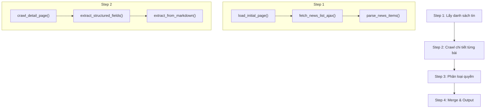

# Logic Crawl VSD bằng Crawl4AI

> **Nguồn:** https://www.vsd.vn/vi/tin-thi-truong-co-so
> **Thư viện:** crawl4ai (v0.8.x) — AsyncWebCrawler + Playwright headless browser

---

## Tổng quan luồng xử lý



---

## Step 1 — Lấy danh sách tin tức từ trang listing

> **Vấn đề:** Trang VSD dùng AJAX POST để load danh sách tin. Khi GET trang chỉ nhận được shell page (menu, navbar). Cần trigger AJAX POST trong browser để lấy nội dung thật.

### Hàm 1: `load_initial_page()`

| | |
|---|---|
| **Mục đích** | Load trang listing VSD lần đầu bằng GET request để browser render DOM và lấy `VPToken` |
| **Input** | URL: `https://www.vsd.vn/vi/tin-thi-truong-co-so` |
| **Output** | Browser session đã render trang + VPToken sẵn sàng trong DOM |

**Logic:**
1. Khởi tạo `AsyncWebCrawler` với `BrowserConfig(headless=True)`
2. Gọi `crawler.arun(url, config)` với `session_id` cố định (để giữ session cho bước sau)
3. Trang GET trả về HTML shell — chứa `<meta name="__VPToken" content="...">` trong DOM
4. Không cần extract gì ở bước này, chỉ cần browser session sống

---

### Hàm 2: `fetch_news_list_ajax(page_number)`

| | |
|---|---|
| **Mục đích** | Trigger AJAX POST trong browser để lấy danh sách tin tức từ VSD |
| **Input** | `page_number` (1, 2, 3...) — số trang cần lấy |
| **Output** | HTML chứa danh sách `<li>` với link + tiêu đề + ngày |

**Logic:**
1. Sử dụng `js_code` để chạy JavaScript trong browser context:
   ```javascript
   // 1. Lấy VPToken từ meta tag đã render ở Step 1
   const vpToken = document.querySelector('meta[name="__VPToken"]').content;

   // 2. Gọi AJAX POST (giống cách trang VSD thật hoạt động)
   const response = await fetch('/vi/tin-thi-truong-co-so', {
       method: 'POST',
       headers: {
           'Content-Type': 'application/json',
           'X-Requested-With': 'XMLHttpRequest',
           '__VPToken': vpToken
       },
       body: JSON.stringify({ SearchKey: 'TCPH', CurrentPage: page_number })
   });

   // 3. Inject kết quả vào DOM để crawl4ai extract được
   const html = await response.text();
   document.getElementById('vsd-ajax-result').innerHTML = html;
   ```
2. Cấu hình `CrawlerRunConfig`:
   - `session_id` = session từ bước 1 (giữ browser context)
   - `js_only=True` — không navigate lại URL, chỉ chạy JS trên page hiện tại
   - `wait_for="js:() => window.__vsdAjaxDone === true"` — đợi JS hoàn thành
3. Gọi `crawler.arun(url, config)` — trả về `CrawlResult` với HTML đã inject

---

### Hàm 3: `parse_news_items(html)`

| | |
|---|---|
| **Mục đích** | Parse HTML danh sách tin để lấy code, title, URL, date |
| **Input** | HTML string (từ AJAX response hoặc `result.html`) |
| **Output** | `List[dict]` — mỗi item gồm `{code, title, url, date}` |

**Logic:**
1. Parse HTML bằng BeautifulSoup (từ `result.html` của crawl4ai)
2. Tìm container `#vsd-ajax-result`, duyệt tất cả `<li>`:
   ```html
   <li>
     <h3><a href="/vi/ad/194831">GEX: Trả cổ tức năm 2025...</a></h3>
     <div class="time-news">24/04/2026</div>
   </li>
   ```
3. Với mỗi `<li>`:
   - Extract `title` từ `h3 > a` text
   - Extract `url` từ `h3 > a[href]` → normalize thành full URL
   - Match regex `([A-Z0-9]{2,10}):` trên title → lấy `code`
   - Extract `date` từ `.time-news` → regex `(\d{1,2}/\d{1,2}/\d{4})`
4. Filter: chỉ giữ items có mã CK hợp lệ
5. Lặp lại Step 1 hàm 2 + hàm 3 cho `page_number = 2, 3, ...` cho đến khi gặp tin quá cũ (> N ngày)

---

## Step 2 — Crawl chi tiết từng bài viết

> **Cấu trúc HTML chi tiết VSD:** Mỗi field nằm trong cặp div:
> ```html
> <div class="col-md-4 item-info">Label:</div>
> <div class="col-md-8 item-info item-info-main">Value</div>
> ```

### Hàm 4: `crawl_detail_page(article_url)`

| | |
|---|---|
| **Mục đích** | Crawl 1 bài viết chi tiết VSD và lấy raw HTML + markdown |
| **Input** | URL bài viết, vd: `https://www.vsd.vn/vi/ad/194831` |
| **Output** | `CrawlResult` chứa `html`, `markdown`, `extracted_content` |

**Logic:**
1. Khởi tạo `AsyncWebCrawler` mới (không cần session, mỗi bài là 1 request độc lập)
2. Cấu hình `CrawlerRunConfig`:
   - `extraction_strategy = JsonCssExtractionStrategy(detail_schema)` — CSS selector
   - `cache_mode = CacheMode.BYPASS` — không cache
3. Schema cho CSS extraction:
   ```python
   detail_schema = {
       "name": "VSD Detail Fields",
       "baseSelector": ".detail-info .row, .info-detail .row, main .row",
       "fields": [
           {"name": "label", "selector": ".col-md-4", "type": "text"},
           {"name": "value", "selector": ".col-md-8", "type": "text"}
       ]
   }
   ```
4. Gọi `crawler.arun(url, config)` → trả về result

> [!TIP]
> Có thể dùng `arun_many()` để crawl nhiều bài song song (concurrent).

---

### Hàm 5: `extract_structured_fields(crawl_result)`

| | |
|---|---|
| **Mục đích** | Extract các fields chi tiết từ CrawlResult, dùng 3 approach theo thứ tự ưu tiên |
| **Input** | `CrawlResult` từ hàm 4 |
| **Output** | `dict` với 11+ fields đã extract |

**Logic — 3 tầng fallback:**

#### Approach A — CSS Extraction Strategy (ưu tiên 1)
- Parse `result.extracted_content` (JSON) → list các `{label, value}`
- Map label → field:

| Label chứa | → Field |
|---|---|
| `tên tổ chức đăng ký` / `tên tcđkck` | `tên_tổ_chức_đăng_ký` |
| `tên chứng khoán` | `tên_chứng_khoán` |
| `mã chứng khoán` / `mã ck` | `mã_chứng_khoán` |
| `mã isin` | `mã_isin` |
| `nơi giao dịch` | `nơi_giao_dịch` |
| `loại chứng khoán` | `loại_chứng_khoán` |
| `ngày đăng ký` + `cuối` | `ngày_đăng_ký_cuối` |
| `lý do` / `mục đích` | `lý_do_mục_đích` |
| `tỷ lệ` + `thực hiện` | `tỷ_lệ_thực_hiện` |
| `thời gian` + `thực hiện` | `thời_gian_thực_hiện` |
| `địa điểm` + `thực hiện` | `địa_điểm_thực_hiện` |

- **Kết quả thực tế:** extract được ~8/11 fields (các field nằm trong cấu trúc `col-md-4`/`col-md-8`)

#### Approach B — HTML parsing với BeautifulSoup (ưu tiên 2)
- Parse `result.html` bằng BeautifulSoup
- Tìm tất cả `div.col-md-4`, lấy text → label
- Tìm `div.col-md-8` kế tiếp → value
- Map tương tự Approach A
- **Chỉ fill các fields chưa có** từ Approach A

#### Approach C — Markdown regex parsing (ưu tiên 3)
- Parse `result.markdown.raw_markdown`
- Dùng regex cho từng field chưa extract được:
  ```python
  r'Tỷ lệ thực hiện[:\s|]+([^\n|]+)'
  r'Thời gian thực hiện[:\s|]+([^\n|]+)'
  r'Địa điểm thực hiện[:\s|]+([^\n|]+)'
  ```
- **Hiệu quả:** bổ sung ~2-3 fields mà CSS/BS4 bỏ sót (thường là các field nằm ngoài cấu trúc table, ở dạng text tự do)

---

## Step 3 — Phân loại quyền (9 cột)

### Hàm 6: `classify_rights(text_content, title)`

| | |
|---|---|
| **Mục đích** | Phân loại bài viết vào 9 nhóm quyền dựa trên keyword matching |
| **Input** | `text_content` (nội dung bài) + `title` (tiêu đề) |
| **Output** | `dict` với 9 fields quyền (giá trị hoặc `None`) |

**Logic:**
- Ghép `text_content + title` thành `search_text`
- Với mỗi nhóm quyền, dùng keyword map để tìm:

| Nhóm quyền | Keywords mẫu |
|---|---|
| `quyền_họp_đại_hội_cổ_đông` | "đại hội đồng cổ đông thường niên", "ĐHĐCĐ", "bất thường", "lấy ý kiến bằng văn bản" |
| `quyền_cổ_tức_tiền` | "chi trả cổ tức bằng tiền", "thanh toán lãi trái phiếu", "thanh toán gốc" |
| `quyền_cổ_tức_cổ_phiếu` | "trả cổ tức bằng cổ phiếu", "phát hành cổ phiếu", "cổ phiếu thưởng" |
| `quyền_mua` | "quyền mua cổ phiếu", "quyền mua trái phiếu chuyển đổi" |
| `quyền_hoán_đổi_chuyển_đổi` | "hoán đổi cổ phiếu", "chuyển đổi trái phiếu" |
| `chứng_quyền` | "chứng quyền", "warrant" |
| `chấp_thuận_đăng_ký` | "đăng ký cổ phiếu", "chấp thuận đăng ký" |
| `tin_hủy` | "hủy ngày đăng ký", "hủy danh sách", "hủy đăng ký" |
| `thay_đổi` | "thay đổi thời gian thanh toán", "chuyển sàn" |

- Logic giống hệt `fetch_vsd.py` — không phụ thuộc crawl4ai

---

## Step 4 — Merge & Output

### Hàm 7: `merge_and_deduplicate(new_records, existing_file)`

| | |
|---|---|
| **Mục đích** | Merge records mới với file JSON/Excel cũ, tránh duplicate |
| **Input** | `new_records` (list dict) + path file cũ |
| **Output** | `merged_records` (list dict) |

**Logic:**
1. Load `vsd_records.json` cũ (nếu có)
2. Tạo set `new_codes` từ records mới
3. Giữ tất cả records mới + records cũ có code không trùng
4. Gán `_record_id`, `status`, `confirmation_status`

---

### Hàm 8: `save_output(records)`

| | |
|---|---|
| **Mục đích** | Lưu kết quả ra JSON + Excel |
| **Input** | `merged_records` |
| **Output** | Files: `vsd_records.json`, `vsd_records.xlsx` |

---

## Sơ đồ tổng hợp

```
┌──────────────────────────────────────────────────────────┐
│  Step 1: Lấy danh sách                                   │
│                                                          │
│  load_initial_page()                                     │
│    └─ AsyncWebCrawler.arun(GET) → browser session        │
│                                                          │
│  fetch_news_list_ajax(page=1,2,3...)                     │
│    └─ js_code: fetch POST + inject HTML → CrawlResult    │
│                                                          │
│  parse_news_items(html)                                  │
│    └─ BeautifulSoup: li > h3 > a → [{code, url, date}]  │
│                                                          │
│  Lặp page cho đến khi gặp tin quá cũ (> KEEP_DAYS ngày) │
└─────────────────────────┬────────────────────────────────┘
                          │
                          ▼
┌──────────────────────────────────────────────────────────┐
│  Step 2: Crawl chi tiết (concurrent)                     │
│                                                          │
│  crawl_detail_page(url)   ← arun_many() cho tất cả URLs │
│    └─ JsonCssExtractionStrategy + raw HTML + markdown    │
│                                                          │
│  extract_structured_fields(result)                       │
│    ├─ Approach A: CSS Strategy   → ~8/11 fields  ★       │
│    ├─ Approach B: BS4 HTML       → fallback fields       │
│    └─ Approach C: Markdown regex → +2-3 fields           │
│                                                          │
│  Kết quả: 10-11/11 fields cho mỗi bài viết              │
└─────────────────────────┬────────────────────────────────┘
                          │
                          ▼
┌──────────────────────────────────────────────────────────┐
│  Step 3: Phân loại quyền                                 │
│                                                          │
│  classify_rights(text, title)                            │
│    └─ Keyword matching → 9 cột quyền                    │
└─────────────────────────┬────────────────────────────────┘
                          │
                          ▼
┌──────────────────────────────────────────────────────────┐
│  Step 4: Merge & Output                                  │
│                                                          │
│  merge_and_deduplicate()                                 │
│    └─ JSON cũ + records mới → merged list                │
│                                                          │
│  save_output()                                           │
│    ├─ vsd_records.json                                   │
│    └─ vsd_records.xlsx                                   │
└──────────────────────────────────────────────────────────┘
```

---

## Kết quả test thực tế

| Metric | Giá trị |
|---|---|
| Bài test 1 (EIN - ĐHCĐ) | **11/11** fields ✅ |
| Bài test 2 (GEX - cổ tức cổ phiếu) | **10/11** fields ✅ (thiếu `thời_gian_thực_hiện` — không có trong bài gốc) |
| Danh sách page 1 | **14 bài viết** từ AJAX POST |
| Thời gian crawl 1 bài | ~2-3 giây (headless browser) |
| Thời gian tổng (list + 1 detail) | ~8 giây |
