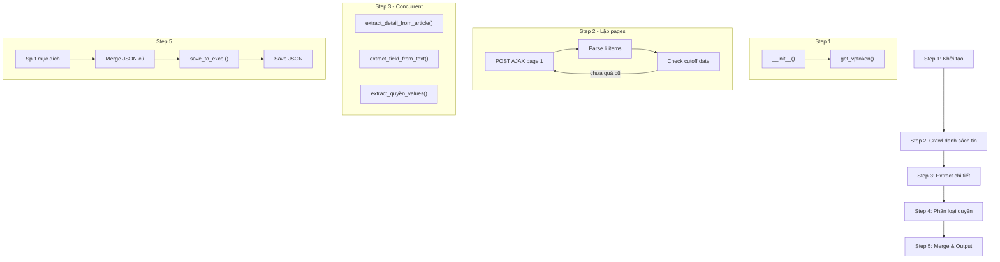

# Logic Crawl VSD bằng Requests + BeautifulSoup

> **File:** `fetch_vsd.py`
> **Nguồn:** https://www.vsd.vn/vi/tin-thi-truong-co-so
> **Thư viện:** requests, BeautifulSoup, concurrent.futures

---

## Tổng quan luồng xử lý



---

## Step 1 — Khởi tạo session

### Hàm 1: `__init__()`

| | |
|---|---|
| **Mục đích** | Khởi tạo VSDFetcher với session HTTP persistent |
| **Input** | Hằng số `KEEP_DAYS` (số ngày cần lấy, mặc định 7) |
| **Output** | Instance với `self.session`, `self.headers`, `self.keep_days` |

**Logic:**
1. Tạo `requests.Session()` — giữ cookies giữa các request
2. Set headers giả lập browser (User-Agent, Accept-Language: vi-VN)
3. Gán `self.keep_days = KEEP_DAYS` (config ở đầu file)

---

### Hàm 2: `get_vptoken()`

| | |
|---|---|
| **Mục đích** | Lấy VPToken từ meta tag trên trang listing |
| **Input** | GET `https://www.vsd.vn/vi/tin-thi-truong-co-so` |
| **Output** | `self.vptoken` (string) dùng cho AJAX POST |

**Logic:**
1. GET trang listing → parse HTML
2. Tìm `<meta name="__VPToken" content="...">` → lấy `content`
3. Lưu vào `self.vptoken`

> [!IMPORTANT]
> VPToken **bắt buộc** cho mọi AJAX POST. Không có token → server trả 403.

---

## Step 2 — Crawl danh sách tin tức (trong `fetch_latest_news()`)

### Logic chính: Vòng lặp phân trang

| | |
|---|---|
| **Mục đích** | Lặp qua các trang (page 1, 2, 3...) để lấy tất cả tin từ N ngày gần nhất |
| **Input** | `self.vptoken`, `KEEP_DAYS` |
| **Output** | `all_news: List[dict]` — danh sách `{code, title, url, date, date_obj}` |

**Logic:**
```
page = 1
while page <= 25:
    1. POST /vi/tin-thi-truong-co-so
       Headers: __VPToken, X-Requested-With: XMLHttpRequest
       Body: {"SearchKey": "TCPH", "CurrentPage": page}

    2. Parse HTML response bằng BeautifulSoup
       Tìm tất cả <li> → <h3> → <a>

    3. Với mỗi <li>:
       - Extract title từ <a> text
       - Match regex ([A-Z0-9]{2,10}): → code
       - Extract date từ <div class="time-news">
       - Normalize URL

    4. Check ngày:
       - Lần đầu: set latest_date_found
       - Nếu page_oldest_date <= cutoff_date (today - 7 ngày) → DỪNG
       - Ngược lại: page += 1, tiếp tục

    5. Sau vòng lặp: Filter chỉ giữ tin trong KEEP_DAYS ngày
```

**Điều kiện dừng:**
- Trang có tin cũ hơn `cutoff_date` (today - 7 ngày)
- Trang không có tin nào
- Đạt `max_pages = 25`

---

## Step 3 — Extract chi tiết từng bài viết

### Hàm 3: `extract_detail_from_article(url)`

| | |
|---|---|
| **Mục đích** | Mở URL bài viết, extract tất cả thông tin chi tiết |
| **Input** | URL bài viết, vd: `https://www.vsd.vn/vi/ad/194831` |
| **Output** | Tuple `(info_dict, extracted_code, actual_update_date)` |

**Logic — 2 giai đoạn:**

#### Giai đoạn A: Extract từ HTML structure (col-md-4 / col-md-8)

```python
# Cấu trúc HTML:
# <div class="col-md-4 item-info">Tên chứng khoán:</div>
# <div class="col-md-8 item-info item-info-main">Cổ phiếu GELEX</div>

for label_div in soup.find_all('div', class_='col-md-4'):
    label = label_div.get_text(strip=True).lower()
    value_div = label_div.find_next('div', class_='col-md-8')
    value = value_div.get_text(strip=True)
    # Map label → info field
```

**Bảng mapping:**

| Label chứa | → Field |
|---|---|
| `tên tổ chức đăng ký` / `tên tcđkck` | `tên_tổ_chức_đăng_ký` |
| `tên chứng khoán` | `tên_chứng_khoán` |
| `mã chứng khoán` / `mã ck` | `mã_chứng_khoán` (+ `extracted_code`) |
| `mã isin` | `mã_isin` |
| `nơi giao dịch` | `nơi_giao_dịch` |
| `loại chứng khoán` | `loại_chứng_khoán` |
| `ngày đăng ký` + `cuối` | `ngày_đăng_ký_cuối` |
| `lý do` / `mục đích` | `lý_do_mục_đích` |
| `tỷ lệ` + `thực hiện` | `tỷ_lệ_thực_hiện` |
| `thời gian` + `thực hiện` | `thời_gian_thực_hiện` |
| `địa điểm` + `thực hiện` | `địa_điểm_thực_hiện` |

#### Giai đoạn B: Fallback — Extract từ text content bằng regex

Nếu giai đoạn A không lấy được field nào đó, dùng `extract_field_from_text()`:

```python
# Pattern: "Label: Value" hoặc "Label:\n+ bullet1\n+ bullet2"
pattern = f"{field_label}[:\\s]+([^\\n]+(?:\\n\\s*[+\\-•]\\s*[^\\n]+)*)"
```

- `tỷ_lệ_thực_hiện` — thường ở dạng text tự do, max 1000 chars
- `thời_gian_thực_hiện` — max 300 chars
- `địa_điểm_thực_hiện` — thường có bullet points, max 500 chars
- `lý_do_mục_đích` — max 300 chars
- `tên_tổ_chức_đăng_ký` — tìm pattern "Tên TCĐKCK:"

#### Cutoff text content:

Trước khi parse, cắt text tại các marker:
- `"tin cùng tổ chức"`
- `"mã ck hủy đăng ký"`
- `"mã ck chuyển sàn"`

→ Tránh lấy nhầm data từ phần footer/sidebar.

---

### Hàm 4: `extract_field_from_text(text, field_label, max_length)`

| | |
|---|---|
| **Mục đích** | Extract 1 field value từ text content bằng regex |
| **Input** | `text`, `field_label` (vd: "Tỷ lệ thực hiện"), `max_length` |
| **Output** | String value hoặc `None` |

---

### Hàm 5: `extract_field_bullets(text, field_label)`

| | |
|---|---|
| **Mục đích** | Extract field value và split thành list nếu có bullet points |
| **Input** | `text`, `field_label` |
| **Output** | `List[str]` hoặc `None` |

**Ví dụ:**
```
"Tỷ lệ thực hiện:
+ Quyền 1: 4:1
+ Quyền 2: 10:1"
→ ['Quyền 1: 4:1', 'Quyền 2: 10:1']
```

---

### Concurrent execution

```python
# 5 workers chạy song song
with ThreadPoolExecutor(max_workers=5) as executor:
    for news in filtered_news:
        future = executor.submit(extract_with_retry, news)
        # Retry tối đa 2 lần, delay 0.3s giữa retry
```

---

## Step 4 — Phân loại 9 nhóm quyền

### Hàm 6: `extract_quyền_values(text, value_keywords_map)`

| | |
|---|---|
| **Mục đích** | Tìm các giá trị quyền trong text bằng keyword matching |
| **Input** | `text` (search_text = text_content + title), `value_keywords_map` |
| **Output** | Comma-separated string hoặc `None` |

**9 nhóm quyền và keywords:**

| # | Field | Giá trị → Keywords |
|---|---|---|
| 1 | `quyền_họp_đại_hội_cổ_đông` | ĐHCĐ thường niên, bất thường, lấy ý kiến bằng văn bản |
| 2 | `quyền_cổ_tức_tiền` | cổ tức bằng tiền, thanh toán lãi/gốc trái phiếu, mua lại trái phiếu |
| 3 | `quyền_cổ_tức_cổ_phiếu` | cổ tức bằng cổ phiếu, phát hành cổ phiếu, cổ phiếu thưởng |
| 4 | `quyền_mua` | quyền mua cổ phiếu, quyền mua trái phiếu chuyển đổi |
| 5 | `quyền_hoán_đổi_chuyển_đổi` | hoán đổi cổ phiếu, chuyển đổi trái phiếu |
| 6 | `chứng_quyền` | chứng quyền, warrant |
| 7 | `chấp_thuận_đăng_ký` | đăng ký cổ phiếu/trái phiếu |
| 8 | `tin_hủy` | hủy ngày đăng ký, hủy danh sách, hủy đăng ký |
| 9 | `thay_đổi` | thay đổi thời gian thanh toán, chuyển sàn |

**Logic:**
```python
search_text = text_content + " " + title
for value, keywords in value_keywords_map.items():
    for keyword in keywords:
        if keyword.lower() in search_text.lower():
            found_values.append(value)
            break
return ', '.join(found_values) if found_values else None
```

---

## Step 5 — Merge, Split mục đích & Output

### 5.1 Split records có nhiều mục đích

| | |
|---|---|
| **Mục đích** | Tách 1 record thành nhiều records nếu `lý_do_mục_đích` chứa dấu `;` |
| **Ví dụ** | `"Trả cổ tức bằng cổ phiếu; Phát hành cổ phiếu tăng vốn"` → 2 records |

**Logic:**
1. Nếu `lý_do_mục_đích` chứa `;` → split thành list
2. Thử split `text_content` theo numbered sections (`1.`, `2.`, ...)
3. Tạo record clone cho mỗi mục đích:
   - Update `lý_do_mục_đích` = mục đích riêng
   - Extract `tỷ_lệ_thực_hiện` từ section tương ứng
   - Update `title` = `"CODE: mục đích"`
   - Gán `_record_id` = `"CODE_1"`, `"CODE_2"` (unique, stable)

---

### 5.2 Hàm 7: `generate_record_id(record, split_idx)`

| | |
|---|---|
| **Mục đích** | Tạo stable ID cho record (idempotent qua nhiều lần chạy) |
| **Input** | Record dict + split index (nếu có) |
| **Output** | String ID, vd: `"GEX"`, `"GEX_1"`, `"rec_a1b2c3d4"` |

**Logic:**
- Có `code` → dùng code làm ID
- Không có code → hash MD5 từ `title + date` → `"rec_{hash[:8]}"`
- Nếu split → append `"_{split_idx}"` → `"GEX_1"`, `"GEX_2"`

---

### 5.3 Merge với records cũ

**Logic:**
1. Load `vsd_records.json` (thử nhiều paths: Docker `/app/...` và local)
2. Tạo `new_codes_set` từ records mới
3. Giữ tất cả records mới (kể cả split)
4. Thêm records cũ có code **không trùng** với code mới
5. Gán `_record_id` cho records chưa có

---

### 5.4 Hàm 8: `save_to_excel(data, output_path)`

| | |
|---|---|
| **Mục đích** | Tạo/update file Excel với merged records |
| **Input** | Result dict + output path |
| **Output** | File `.xlsx` với sheet "Tin chứng khoán" |

**Logic:**
1. Nếu file cũ tồn tại → đọc, giữ records cũ không trùng code mới
2. Tạo DataFrame từ merged records
3. Write Excel với `openpyxl`, auto-adjust column widths

---

### 5.5 Save JSON (trong `main()`)

**Logic:**
1. Đọc lại Excel đã merge → convert to dict records
2. Gán `status = "pending"`, `confirmation_status = "awaiting_review"`
3. Lưu JSON với structure:
```json
{
  "status": "success",
  "date": "2026-04-25",
  "records": [...],
  "total_records": 150,
  "fetched_at": "2026-04-25T20:00:00",
  "merge_info": "14 new records merged with existing"
}
```

---

## Sơ đồ tổng hợp

```
┌──────────────────────────────────────────────────────────┐
│  Step 1: Khởi tạo                                        │
│                                                          │
│  __init__() → Session + headers                          │
│  get_vptoken() → GET page → meta __VPToken               │
└─────────────────────────┬────────────────────────────────┘
                          │
                          ▼
┌──────────────────────────────────────────────────────────┐
│  Step 2: Crawl danh sách (trong fetch_latest_news)       │
│                                                          │
│  while page <= 25:                                       │
│    POST /vi/tin-thi-truong-co-so                         │
│      Body: {SearchKey: "TCPH", CurrentPage: page}        │
│      Headers: __VPToken                                  │
│    Parse <li> → {code, title, url, date}                 │
│    Nếu oldest_date <= cutoff → DỪNG                      │
│                                                          │
│  Filter: chỉ giữ KEEP_DAYS ngày gần nhất                │
└─────────────────────────┬────────────────────────────────┘
                          │
                          ▼
┌──────────────────────────────────────────────────────────┐
│  Step 3: Extract chi tiết (ThreadPoolExecutor, 5 workers)│
│                                                          │
│  extract_detail_from_article(url):                       │
│    ├─ HTML structure: col-md-4/col-md-8 → ~8 fields      │
│    ├─ Text regex fallback → +3 fields                    │
│    └─ Cutoff tại "tin cùng tổ chức"                      │
│                                                          │
│  extract_with_retry(news): max 2 retries, delay 0.3s     │
└─────────────────────────┬────────────────────────────────┘
                          │
                          ▼
┌──────────────────────────────────────────────────────────┐
│  Step 4: Phân loại quyền                                 │
│                                                          │
│  extract_quyền_values(text, keyword_map)                 │
│    → 9 nhóm: ĐHCĐ, cổ tức tiền, cổ tức CP, mua,        │
│      hoán đổi, chứng quyền, đăng ký, hủy, thay đổi     │
└─────────────────────────┬────────────────────────────────┘
                          │
                          ▼
┌──────────────────────────────────────────────────────────┐
│  Step 5: Merge & Output                                  │
│                                                          │
│  Split lý_do_mục_đích (;) → nhiều records               │
│  generate_record_id() → stable ID                        │
│  Merge với vsd_records.json cũ                           │
│  save_to_excel() → vsd_records.xlsx                      │
│  Save JSON → vsd_records.json                            │
└──────────────────────────────────────────────────────────┘
```

---

## Helper functions

| Hàm | Mục đích |
|---|---|
| `parse_date(date_string)` | Parse `"dd/mm/yyyy"` → `datetime.date` |
| `contains_keyword(text, keywords)` | Check text chứa bất kỳ keyword nào |
| `extract_field_from_text(text, label, max_length)` | Regex extract 1 field, hỗ trợ multi-line + bullet |
| `extract_field_bullets(text, label)` | Extract field → split thành list nếu có `+/-/•` |
| `generate_record_id(record, split_idx)` | Tạo stable unique ID cho record |
